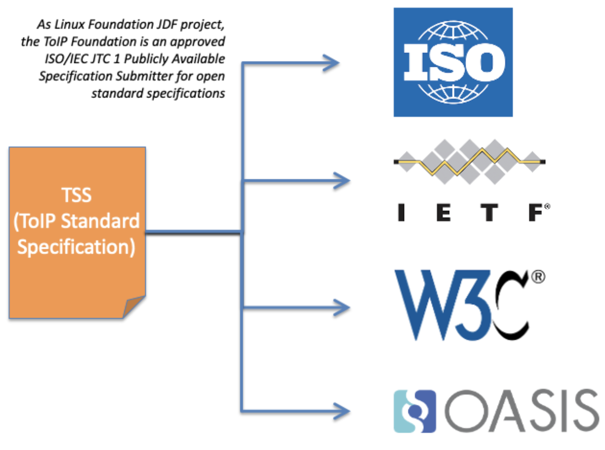

# Lifecycle Management Process

All ToIP deliverables are governed by the standard three-stage approval process defined by our JDF charter (note that this process is the same for all JDF projects at the Linux Foundation).

Stage One: Draft Deliverable
The first stage is a Pre-Draft document submitted or created by one or more WG participant(s). Once this Pre-Draft document is accepted by the WG as the basis for continued work, it becomes a Draft Deliverable.

This document describes the process for the maturation of [ToIP Deliverables](./work_products.md). Each deliverable, regardless of type, follows the same standard lifecycle.

### Abbreviations
| Term | Abbreviation |
| --- | --- |
|Work Group | WG|
|Task Force | TF |

## Process Stages

### Propose

To __propose__ a [type of deliverable](./work_products.md), [use these instructions to raise a PR](./contributing.md) against this repo. A submission to this repo reflects a suggestion for work to be performed by a WG. Proposed
deliverables are considered a "*work-in-progress*", even after they are merged. In other words, they haven't been endorsed by the community yet, but they seem like reasonable ideas worth exploring.

Before a PR for a proposed deliverable can be merged, it **MUST** be embraced by  (*sponsored by*) one of the ToIP WGs.

### Approved
In order for a deliverable to graduate to __approved__ status, it **MUST** be sponsored by a WG. While each WG may have their own lifecycle management process and approval concesus criteria, it is the responsibility of the WG that is sponsoring the deliverable to formally submit a PR that updates the originally proposed deliverable to __approved__ status.

A WG (or a TF within the WG) incubates the proposed deliverable via whatever process it chooses until it is ready for approval by the WG as a whole. This approval can be via consensus at a meeting of the WG or on the mailing list. In either case, it passes if there are no objections.

If there are objections that cannot be resolved, then a formal vote of the WG is required. In this case the Draft Deliverable must be approved by a supermajority (75%) of the participants.

Once approved, it becomes a Working Group Approved Deliverable. It can stop here if WG members do not feel the need for further advancement.

An `approved` deliverable of the type *specification* may seek further incubation down the standards track if the community has decided to submit the deliverable to a SDO.

### Accepted
If a WG seeks Foundation-wide approval, it must submit the deliverable in __accepted__ state to the Executive Director for a vote by the Steering Committee. As with a WG vote, this vote can be by consensus if there are no objections. If there are objections that cannot be resolved, a formal vote requires approval by a supermajority (75%) of the participants.

## Process State Management

See notes about this in [Contributing](./contributing.md#changing-deliverable-status).

## Alternative Stages

### Submission to an SDO
Once a TSS becomes reaches the __accepted__ state, the ToIP Steering Committee can vote to submit it to a designated standards body.

### Retirement
If a WG fails to see progress by the stakeholders associated with a deliverable proposal submission, the WG can change the status of the deliverable to __retired__. This action by the WG can be achieved via consensus at a meeting of the WG or on the WG mailing list.  The causes of such a change vary but generally can result from:

1. a decision to withdraw the proposal from community consideration by its authors;
2. a determination that implementation seems permanently stalled
3. an observation that significant refinements require a superseding proposal

If a retired deliverable has been superseded, its `Superseded By` field should contain a link to the newer spec, and the newer spec's `Supersedes` field should contain a link to the older spec. Permalinks are not broken.
